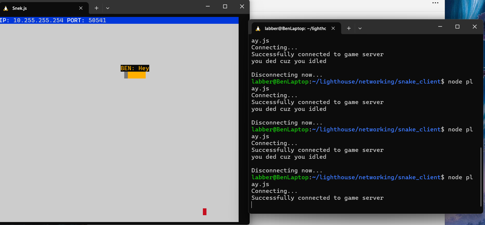
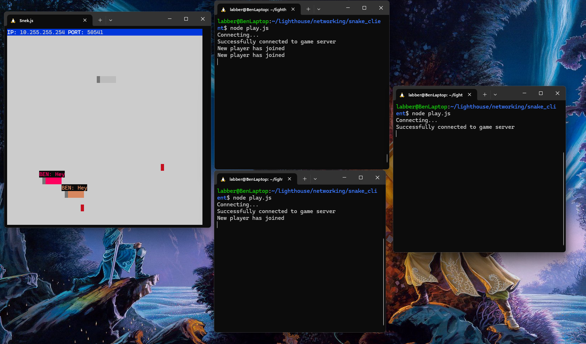

# Snake Client Project by Benjamin Hallam

Snake game is a very popular video game. It is a video game concept where the player maneuvers a dot and grows it by ‘eating’ pieces of food. As it moves and eats, it grows and the growing snake becomes an obstacle to smooth maneuvers. The goal is to grow it to become as big as possible without bumping into the side walls, or bumping into itself, upon which it dies.

This is simply a multiplayer take on the genre.

Before you can run this client, you need to first make sure the server - which can be found  at https://github.com/bendhallam/snake_server - is running.
Note: this is a forked repo of the snake_client originally found at https://github.com/lighthouse-labs/snek-multiplayer, now containing updated code that sends a message to all active clients whenever a new client connects

## Final Product
Two terminals open - one running the server side and the other running the client side

An example of multiple clients being connected to one server. Note: The server messages all other clients when a new client joins.

## Getting Started

- While inside the snake_server directory, run `npm run play`
- In another terminal, while inside the snake_client directory, run `node play.js`
- 'W', 'A', 'S', and 'D' keys move your snake around. (Try not to run into anything)
- Send messages using the 'F', 'G', 'H', 'J', 'K', and 'L' keys. (Disclaimer: Fear not! All messages are PG 13)